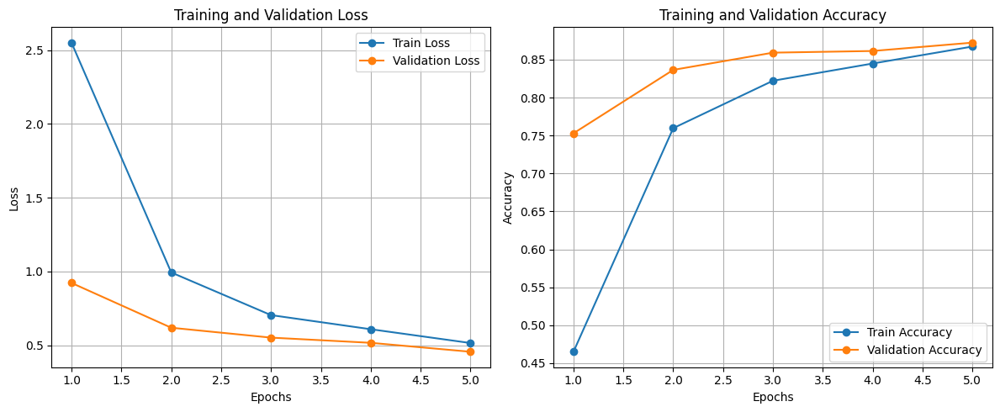
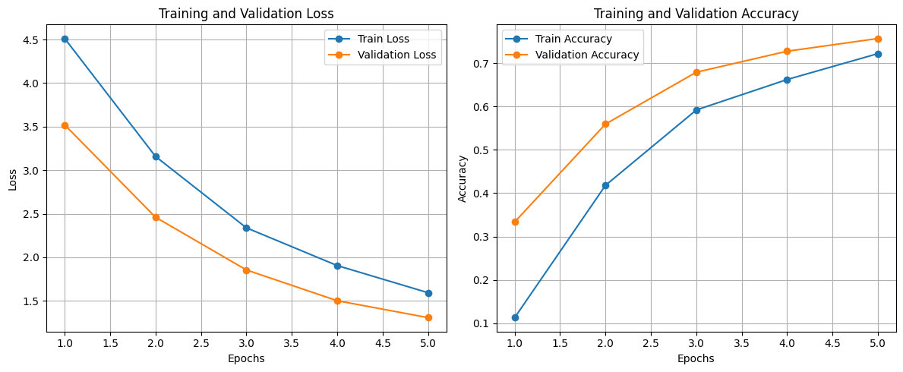
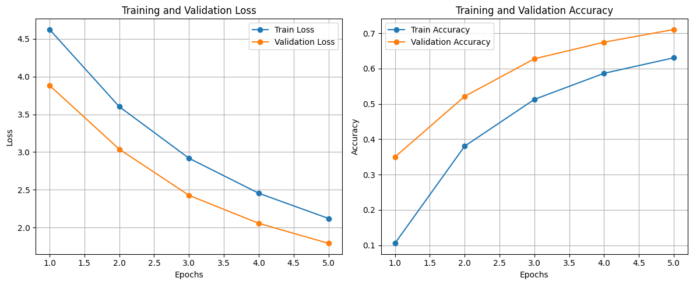
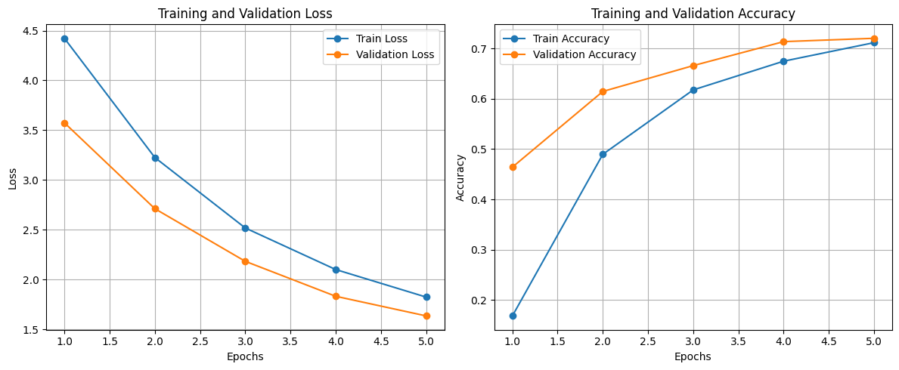
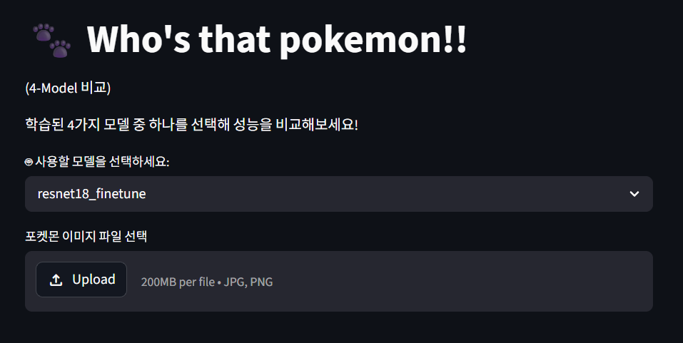
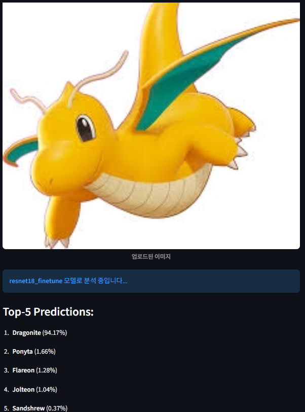

# 🐾 Who's That Pokemon? - Pokemon Classifier

전이 학습(Transfer Learning)을 활용하여 150종의 포켓몬 이미지를 분류하는 딥러닝 기반 웹 어플리케이션입니다. 4가지의 다른 CNN 백본(Backbone) 및 파인 튜닝(Fine-tuning) 전략을 비교 분석하였으며, Streamlit을 이용해 손쉽게 모델을 테스트해 볼 수 있는 GUI를 제공합니다.

## 🛠️ 실행 방법 (How to Run)

**1. 필요 라이브러리 설치**
```bash
pip install -r requirements.txt
```

**2. Streamlit 웹 앱 실행**
```bash
streamlit run app.py
```
*실행 후 터미널에 출력되는 `Local URL` (예: http://localhost:8501)로 접속하시면 포켓몬 분류기 GUI를 사용할 수 있습니다.*

---

## 🧪 실험 설정 (Experimental Settings)
사전 학습된(Pre-trained) 모델들을 활용하여 총 4가지의 분류기를 학습시키고 성능을 비교했습니다.

1. **ResNet-18 (Partial Fine-tuning)**: 가장 성능이 우수한 모델. 마지막 합성곱(Conv) 블록의 동결을 해제하고 추가 학습 진행.
2. **ResNet-18 (Feature Extraction)**: 전체 백본을 동결하고 마지막 분류기(Head)만 학습하여 기준점(Baseline)으로 사용.
3. **GoogLeNet (Feature Extraction)**: Inception 모듈을 사용하여 연산 효율을 높인 백본 모델 테스트.
4. **MobileNetV2 (Feature Extraction)**: 파라미터가 매우 적은 경량화(Lightweight) 모델의 속도 및 성능 테스트.

---

## 📊 모델 성능 비교 (Performance Metrics)

| Model | Accuracy | Precision (Macro) | Recall (Macro) | F1-Score (Macro) |
| :--- | :---: | :---: | :---: | :---: |
| **ResNet-18 (Fine-tuning)** | `0.8724` | `0.8863` | `0.8661` | `0.8620` |
| **ResNet-18 (Extract)** | `0.7566` | `0.7851` | `0.7454` | `0.7402` |
| **GoogLeNet (Extract)** | `0.7104` | `0.7877` | `0.7012` | `0.7057` |
| **MobileNetV2 (Extract)** | `0.7199` | `0.7644` | `0.7103` | `0.7120` |

---

## 📈 학습 곡선 (Learning Curves)
각 모델의 Epoch 별 Training & Validation Loss / Accuracy 그래프입니다.

<table align="center">
  <tr>
    <td align="center"><b>ResNet-18 (Partial Fine-tuning)</b></td>
    <td align="center"><b>ResNet-18 (Feature Extraction)</b></td>
  </tr>
  <tr>
    <td></td>
    <td></td>
  </tr>
  <tr>
    <td align="center"><b>GoogLeNet (Feature Extraction)</b></td>
    <td align="center"><b>MobileNetV2 (Feature Extraction)</b></td>
  </tr>
  <tr>
    <td></td>
    <td></td>
  </tr>
</table>

---

## 🖥️ 데모 화면 (Demo & Top-5 Predictions)

> **💡 Note:** 아래 이미지 경로(`demo_gui.png`, `demo_top5.png`)를 방금 캡처하신 실제 이미지 파일의 이름과 경로로 수정해 주세요! 캡처 이미지를 `result` 폴더 안에 넣고 `result/파일명.png`로 적으시면 깔끔합니다.

모델을 선택하고 포켓몬 이미지를 업로드하면, Top-5 예측 확률을 시각적으로 확인할 수 있습니다.

### 1. Streamlit GUI 메인 화면


### 2. 예측 결과 (Top-5 Predictions)
